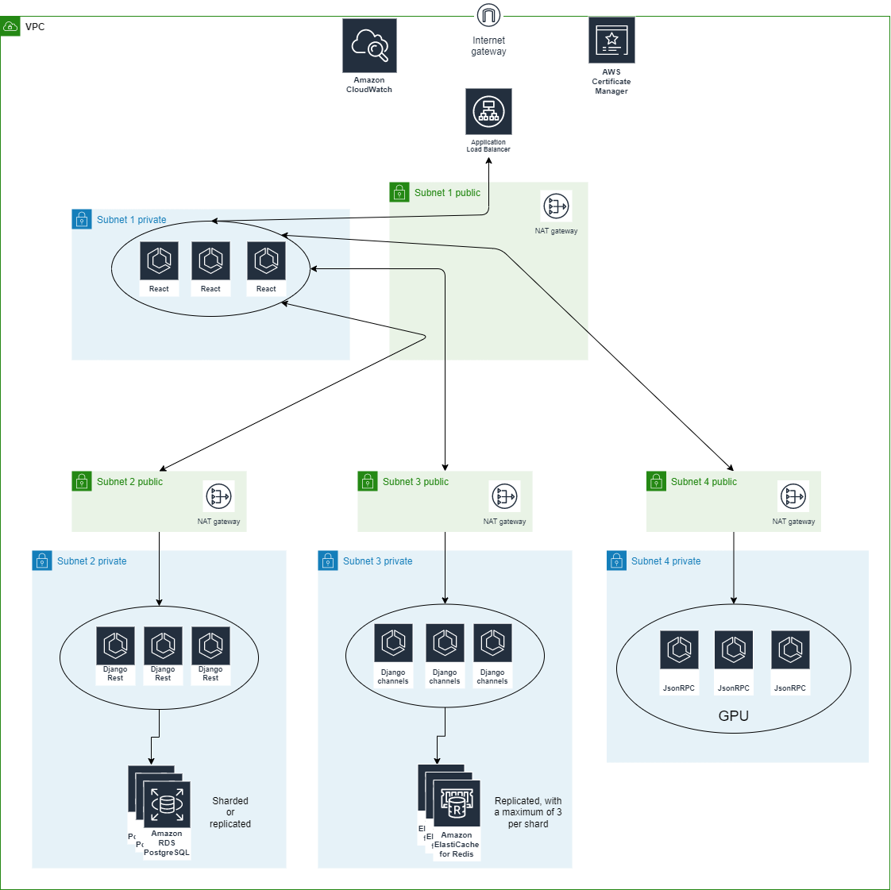

Author note:
============= 

This project was supposed to represent a working distributed system that uses a certain amount of things defined by my professor.

Lamport clocks - The users are to have syncronous events on their screen (the changing images described that use the style transfer, in each of their )

Messaging between services: Rpc and django channels + websockets + redis cache for locking the election process based on a bully algorithm where a user asks for the right to change the image style in real time to all users and begin an election process for who can perform the artistical act of his choice. 

For this algorithm, you would be able to change the background of the image freely using difussion algorithms and style transfer independently via a voting platform where the users can vote on the type of art presented and the machine learning algorithm that will be used to perform the artistical change to the image. 

The image itself could be changed to a video and stream style transfers live to the users by learning the gradient descent necessary to perform the style transfer of the initial first frame of the video. Then, on frame 2, the gradient would begin from the same values on the same position of frame 1. This garanties a low computational cost for the style transfer and a high quality of the video. The video could be streamed to the users in real time, by making ECS/EKS mlfow instances that would be able to perform the style transfer assyncronouly by cutting the video into smaller patches of MxL pixels that could be processed in parallel by the instances. The instances would be able to communicate with each other via a message broker and the results would be sent to the users via a websocket connection. The users would be able to vote on the type of art presented and more types of algorithms could be added, infinetly, held back by costs.

The algorithm in choice can be described in terms of containers, that are discribed in the docker-compose.yml file. 

The containers are:

* React-Typescript front-end + Hooks + RPC client + websocket

* Django rest backend + Postgres/GraphQL for user generated data and image management (+ perhaps ES3 buckets/Data lakes for image storage)

* Redis cache

* JsonRPC (there is one avalaible in rust for parallel tasks and python for GPU intensive tasks on ECS tasks or kubeflow clusters)

* Django channels + websockets + redis manipulation

Following this structure, it would be possible to have a distributed system that uses the lamport clocks to syncronous events
:

