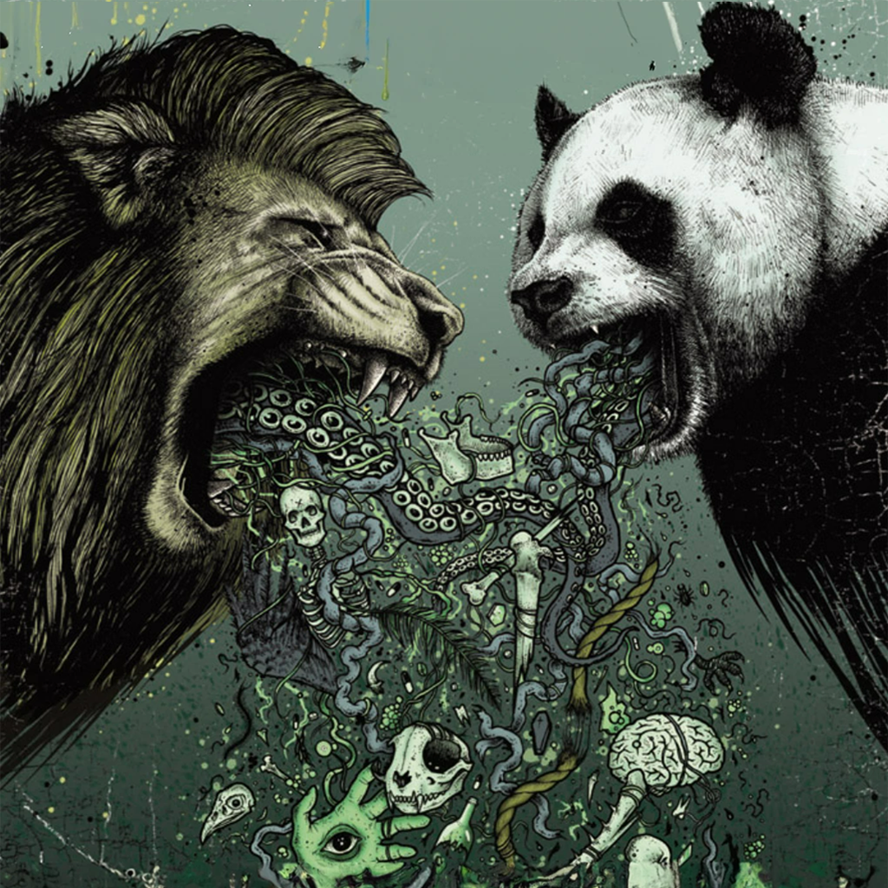

Style transfer
================

This is an implementation of the paper "A Neural Algorithm of Artistic Style" by Leon A. Gatys, Alexander S. Ecker, and Matthias Bethge. The paper can be found here: http://arxiv.org/abs/1508.06576
The algorithm in question is a style transfer for an image that is downsized than style transfered multiple times, than upsampled and transfered again, with less iterations. This is done to avoid long epoch time since github pages only has CPU.

https://github.com/jcjohnson/neural-style/blob/master/LICENSE

It is an open source project, with a lua implementation for the style transfer that takes in an image of different sizes, resizes it to a specified number and creates the output at also a specified number, with also a specified number.

Then using a Diffusion Model, to generate an image to a desirable height for infinate scrolling. The Diffusion Models are generative models which have been gaining significant popularity in the past several years, and for good reason. A handful of seminal papers released in the 2020s alone have shown the world what Diffusion models are capable of, such as beating GANs[6] on image synthesis. Most recently, practitioners will have seen Diffusion Models used in DALL-E 2, OpenAI's image generation model released last month.

The image in question:

    

.. figure:: images/scroll-5.png
    :width: 100 %
    

